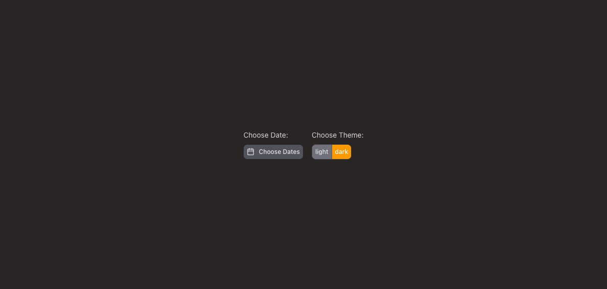
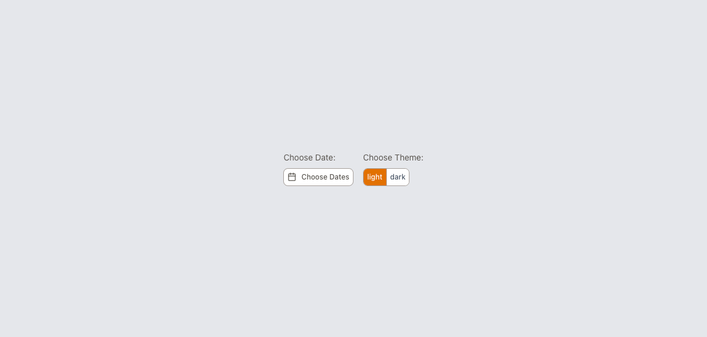
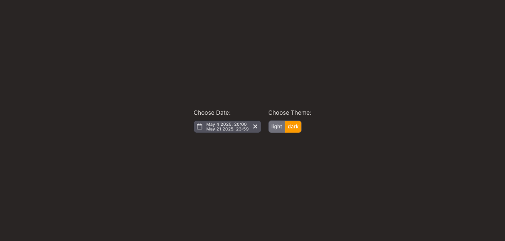
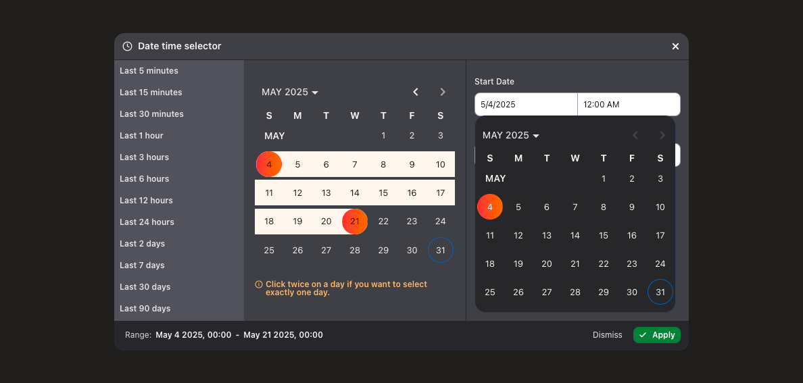
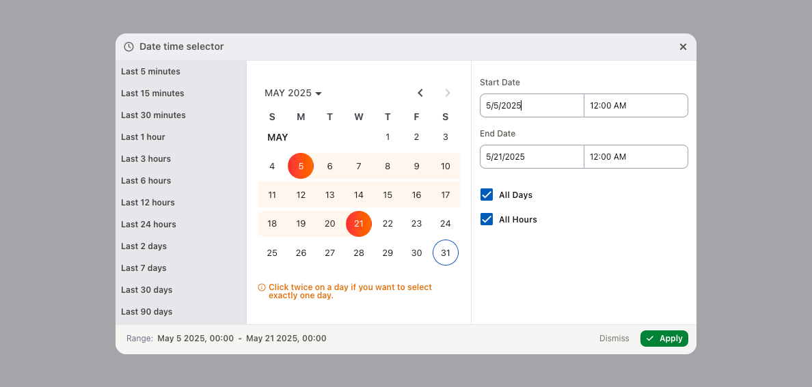
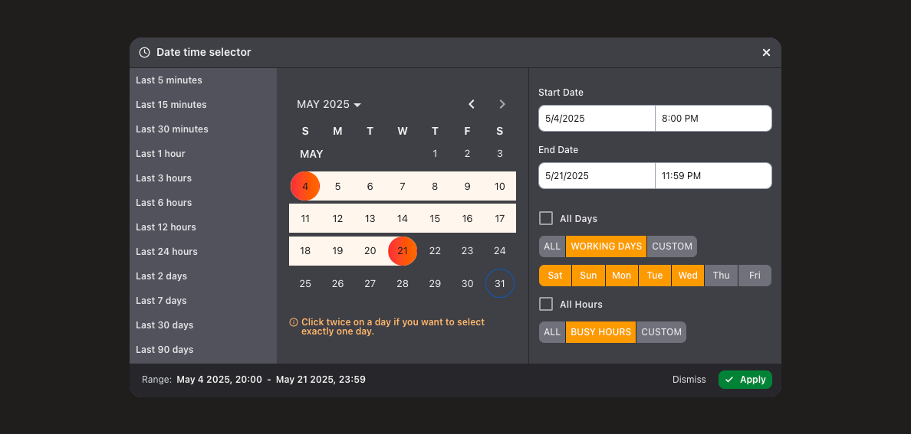
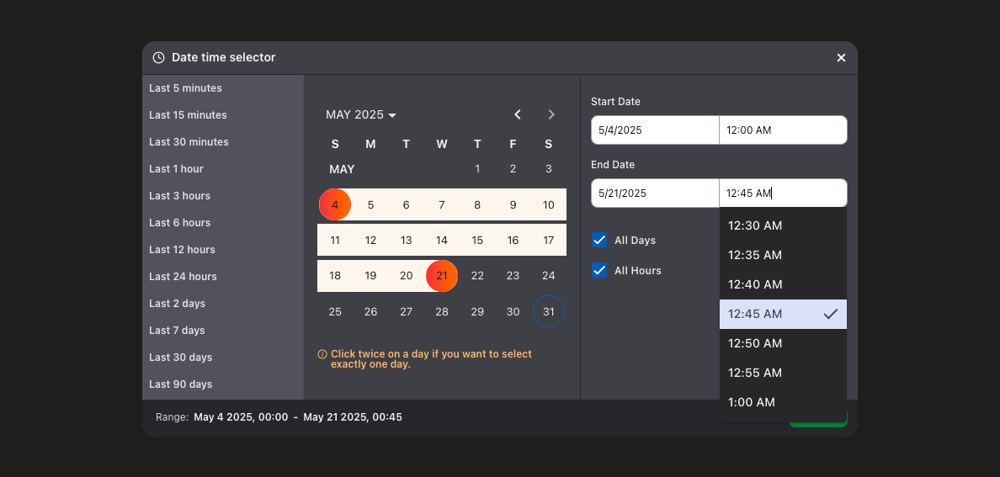

# 📅 Material Tailwind Range Date Picker

A customizable **Date Range Picker** built with **Angular 20**, **Angular Material**, and **Tailwind CSS v4**, supporting **two-way binding**, **date-time offsets**, and a clean Dark/Light modern UI.

👉 **Live Demo:** [omidkh68.github.io/material-tailwind-range-date-picker](https://omidkh68.github.io/material-tailwind-range-date-picker/)

---

## ✨ Features

- ✅ Built with **Angular v20**
- 🎨 Styled using **Tailwind CSS v4**
- 🧱 Uses latest **Angular Material** components
- 🕑 Supports **date & time selection**
- 🔄 **Two-way binding** for start and end date-times using Signal
- 🧭 Handles **offsets** and timezone adjustments
- 📦 Lightweight, responsive, and easy to integrate

---

## 🚀 Getting Started

### Clone the repo
```bash
git clone https://github.com/omidkh68/material-tailwind-range-date-picker.git
cd material-tailwind-range-date-picker
```

### Install dependencies
```bash
npm install
```

### Run the app locally
```bash
ng serve
```

Then visit [http://localhost:4200](http://localhost:4200)

---

## 🛠 Technologies Used

| Tool             | Version |
|------------------|---------|
| Angular          | ^20     |
| Angular Material | ^20     |
| Tailwind CSS     | ^4      |
| Ng-icon          | ^31     |
| TypeScript       | ^5      |

---

## 📚 How to Use

### 1. Add the `DatePicker` in your template
```html
<date-picker [(dateTimePicker)]="dateTimePicker"
             [required]="true"
             (selectedDates)="selectDates($event)"
```

### 2. Bind your variables in the component
```ts
selectedDateRange = model<DateRange<Date> | undefined>();
```

### 3. Offset Support
All date-times are internally normalized using offset logic (e.g., UTC+X), making it ideal for systems with timezone-aware data.

---

## 📷 Screenshots
### Dark view

### Light view

### Selected Dates

### Open dialog in Dark view

### Open dialog in Light view

### Active all features

### Show Timepicker


---

## 📄 License

MIT License © 2025 Omidkh68

---

## 🙌 Contributions

Pull requests are welcome. For major changes, please open an issue first to discuss what you would like to change.
